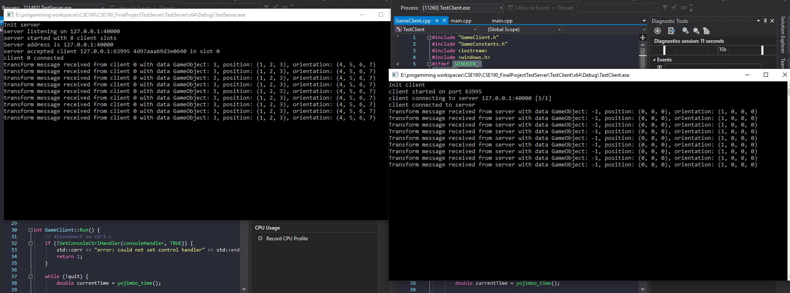
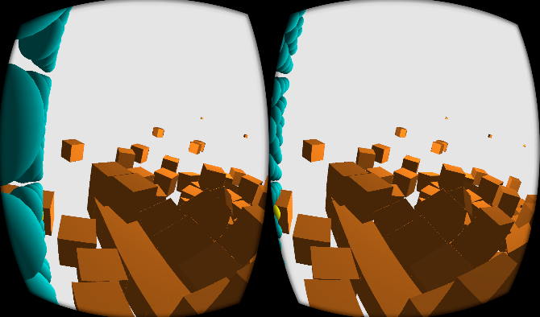
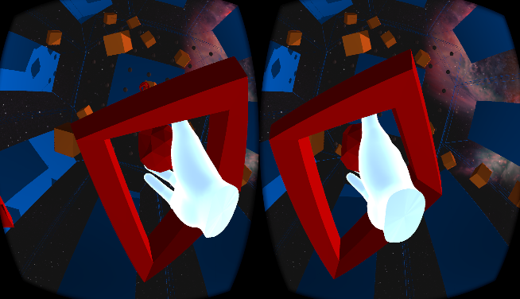

# CSE190_FinalProjectBlog: (Astroid) Space Pong

## Table of Contents

1. [Blog 1](#blog-1)
2. [Blog 2](#blog-2)

<a name="blog-1"/>


## Blog 1

Project Name: (Astroid) Space Pong (astroid part TBD)

Team Members: Alan Mai

### Project Description

2 Players at either end of a tall long box play ping pong with a large, slow moving ball. On each end of the box, there is a grid of hand holds (spheres or cubes) that each player will use to move up and down, side to side on their end of the box. The players can ~~hit the ball with their hands (or some modeled racket)~~ force push the balls with their hands, until it passes the grid and hits a player's wall, resulting in a point for the other player.

If able to, floating cube "astroids" will be spawned in the play area, that can interact with the ball. Or when the ball touches the side/top of the cube, gravity will change to pull towards the opposite (or random) wall (initially no gravity).

```
       grid offset from walls to allow space to climb around
   v----------------v
|----------------------|
|  .                .  |
|  .                .  |
|  .                .  |
|  .                .  |
|  .                .  |
|  .                .  |
|----------------------|
```

### Technical Details

- UDP server using `yojimbo`.
- PhysX physics engine for physics simulation, simulated on both server and client, with server handling corrective updates.
- ~~Rackets~~ Play ball and/or play area modeled in Blender.
- Audio through `OpenAl` as background music, or a fanfare when a player scores.

### Progress Screenshots

UDP server and client transmitting sample transform data.


Example scene with physics and force push on trigger pull.


<a name="blog-2"/>


## Blog 2

No changes to team.

### Progress

Networking is done. Along with it, server side physics works and all clients are synchronized with the server physics. User can now do a "punch" that works similarly to a gogo hand. Lighting is finished, with a point light attatched to the ball, as well as a directional light that casts a shadow using shadow mapping. The game scene is done, users are now in a octagon, rather than a box. Finally, added custom models for the other user's head and models for the hand.

Scrot




